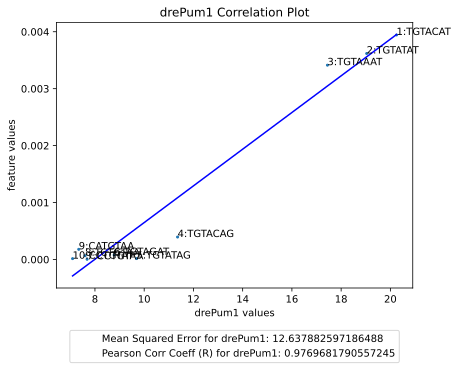
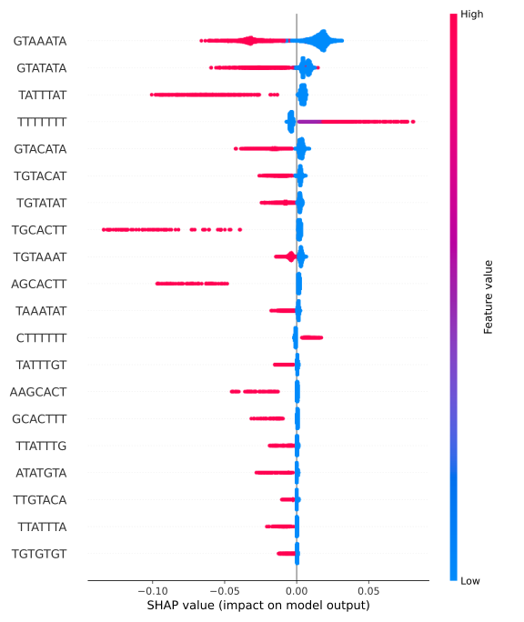

# Utilizing SHAP to Measure Motif Feature Importance

**Author:** Sam Wu, Cifuentes Labs

## Overview

This repository contains code for analyzing motif importance in protein expression and degradation data using machine learning models, specifically an XGBoost Regressor. We explore the relationship between motif feature importance and the Mean RNA Binding Protein (MeanRBP) values of motifs. The project aims to assess how motifs with high MeanRBP influence the expression rate (ER) of proteins.

## Key Objectives

1. **Generate Protein-Specific Datasets:** Format data for individual proteins by calculating expression rates and encoding sequence motifs.

2. **Train XGBoost Models:** Use these datasets to train regression models predicting the expression rate (ER) from sequence features.

3. **Evaluate Model Performance:** Use metrics such as Root Mean Squared Error (RMSE), R-squared (R²), and Pearson Correlation Coefficient (R) to assess model accuracy.

4. **Feature Importance Analysis:** Utilize SHAP (SHapley Additive exPlanations) to analyze the importance of motifs in predicting ER.

5. **Correlation Analysis:** Plot MeanRBP values against SHAP feature importance values to understand their relationship.

***

## Methods

### 1. **Dataset Preparation**

The script processes RNA sequence data for each protein. Key steps include:

- **Loading Expression Data:** Read expression rate data from a CSV file.

- **Extracting Top Motifs:** Identify the top motifs from RNA binding protein data.

- **Encoding Sequences:** Use a custom count-based encoding to represent motifs in RNA sequences.

- **Calculating Expression Rates (ER):** Compute ER as the difference in expression levels over time, divided by 2.

### 2. **Training the Model**

An XGBoost Regressor is trained on the dataset for a selected protein.

- **Features (X):** Encoded motif features.

- **Target (Y):** Computed ER values.

- **Data Splitting:** The dataset is split into training (80%) and testing (20%) sets.

### 3. **Model Evaluation**

The trained model is evaluated using:

- **Root Mean Squared Error (RMSE):** Measures prediction error.

- **R-squared Score (R²):** Explains variance in predictions.

- **Pearson Correlation Coefficient (R):** Correlation between actual and predicted ER values.

### 4. **SHAP Analysis**

SHAP values are calculated to interpret the importance of motifs in the trained model.

- **Tree Explainer:** Efficient computation of SHAP values for tree-based models like XGBoost.

- **Feature Importance Extraction:** Visualize the influence of each motif on model predictions.

### 5. **Correlation with MeanRBP**

Correlation analysis is performed between:

- **MeanRBP values:** Average RNA binding protein affinity for each motif.

- **SHAP feature importance values:** Extracted from the trained XGBoost model.

The correlation is visualized using scatter plots with linear regression lines, annotated with:

- Mean Squared Error (MSE).

- Pearson Correlation Coefficient (R).

***

## Results

After running the model, one can observe strong correlations between a motif's MeanRBP and feature importance. For example, the plot below shows a strong correlation between MeanRPB and feature importance for motifs in Pum1. 

Examining the violin plot the SHAP values, we can see that the model was able to identify key motifs in Pum1 and measure their effect on the ER.

These findings lead us to believe that the MeanRBP of a protein correlates to its effect on expression rate. It also shows the ability of XGBoost Regressor to discover these correlations through the data. 

***

## Usage

### Prerequisites

- Python 3.x

- Required Libraries: see requirement.txt

### Steps

1. **Clone the Repository:**

       git clone https://github.com/SamuelTWu/SHAP-Motif-Feature-Importance.git
       cd SHAP-Motif-Feature-Importance

2. **Prepare Data:** Ensure input data files (`Rabani_expression_A+.csv`, motif dictionaries, etc.) are placed in the `data` directory.

3. **Run the Script:** Execute main scripts in the main.ipynb notebook

4. **Analyze Results:** Check the `plots` directory for correlation plots and the `models` directory for saved XGBoost models.

***

## Contact

For questions or contributions, please reach out to Sam Wu at samwu@bu.edu or open an issue on this repository.
